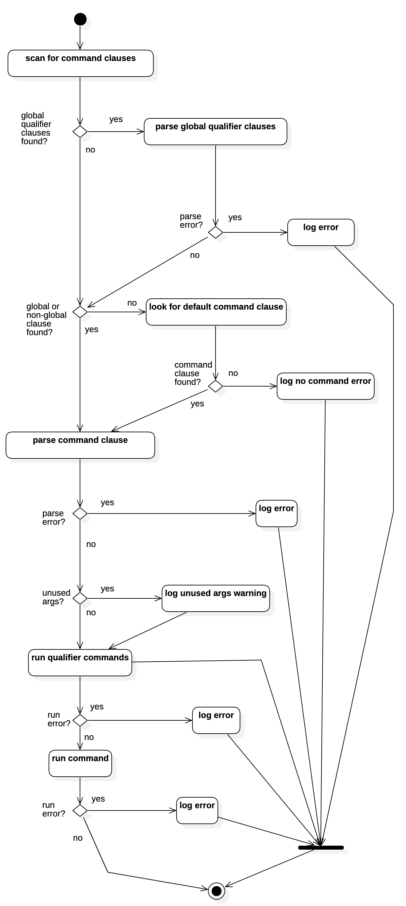

# cli-template
[](https://github.com/flowscripter/cli-framework/blob/master/LICENSE.md)
[](https://david-dm.org/flowscripter/cli-framework)
[](https://travis-ci.com/flowscripter/cli-framework)
[](https://sonarcloud.io/dashboard?id=flowscripter_cli-framework)
[](https://www.npmjs.com/package/@flowscripter/cli-framework)

> CLI framework using ES Modules.

**NOTE: This project is still under active development!**

## Overview

This project provides a Javascript framework for developing Command Line Interface (CLI) applications running in NodeJS.

#### Key Features

* Dynamic plugin based import of commands using [@flowscripter/esm-dynamic-plugins](https://github.com/flowscripter/esm-dynamic-plugins)
* ES2015 module based
* Written in Typescript
* Minimal dependencies
* Support for persisted configuration
* Built in commands for help, version management and plugin management.
* Support for either:
    * Simple Arguments e.g. `executable [global_arguments]`
    * Command Based Arguments e.g. `executable [global_arguments] <command> [command_arguments]`

#### Key Concepts

The key concepts are:

* A host application extends the *CLI* interface (a default CLI implementation is provided).
* The *CLI* is responsible for:
    * maintaining a list of *CommandFactories* and ensuring the *Commands* they provide are available to a *Runner*
    when it parses arguments to find a *Command* to execute.
    * maintaining a list of *ServiceFactories* and ensuring the *Services* they provide are available in the *Context*
    when a *Command* is run.
    * providing invocation arguments to the *Runner* which parses them and determines which *Command* to run.
* When a *Command* is run, it is provided with a *Context* which provides access to a number of *Services*.
* The *PluginCommandFactory* is an instance of a *CommandFactory* providing the ability to dynamically
load *CommandPlugins* which consist of one or more *Command* implementations.
* The *PluginServiceFactory* is an instance of a *ServiceFactory* providing the ability to dynamically
load *ServicesPlugins* which consist of one or more *Service* implementations.

The following high level class diagram illustrates these relationships:


## Commands

All functionality for a CLI is implemented within a *Command*. The *Command* declares:

* a `name` which should be specified in the command line arguments to invoke it. The name must consist of
alphanumeric non-whitespace ASCII characters or `_` and `-` characters. It also cannot start with `-`.
* a number of expected arguments (explained further below)
* a function to run to execute the command
* some basic configuration options which define its type and therefore how it is invoked

The types of command are: *Global*, *Global Qualifier*, *Default* and *Non-Global* (i.e. a normal *Command*)

#### Command

A normal command is invoked as follows:

    executable <command_name> [command_arguments]

Some concrete examples:

    myHelloWorldApp say hello
    myNetworkApp connect --host=localhost

#### Default Command

If a command is declared *default* it will be run if no other command is extracted from the command line:

    executable [default_command_arguments]

Some concrete examples (if the previous example commands were set as default):

    myHelloWorldApp hello
    myNetworkApp --host localhost

NOTE: There can be only one default command provided to the CLI framework.

#### Global Command

A global command allows a command to be specified in the form of a global option:

    executable --<global_command_name> [global_command_arguments]

A concrete example:

    myNetworkApp --help connect

**NOTE**: Global commands only support *positionals* (and not *options*). See "Global and Global Qualifier Command Arguments" further below.

#### Global Qualifier Command

A global qualifier command is also specified in the form of a global option. There can be more than one
global qualifier command specified:

    executable --<global_qualifier_command_1_name> [global_qualifier_command_1_arguments] \
               --<global_qualifier_command_2_name> [global_qualifier_command_2_arguments] \
               <command_name> [command_arguments]

Each command will be executed before any other specified global, non-global (i.e.
normal) or default command is executed. This behaviour allows them to modify the context in which later commands run.

A concrete example:

    myNetworkApp --loglevel debug download --host=localhost --all

**NOTE**: Global qualifier commands only support *positionals* (and not *options*). See "Global and Global Qualifier Command Arguments" further below.

## Arguments

Arguments can take two forms: *Option* or *Positional*.

Common to both are the following features:

* a `name` which must consist of alphanumeric non-whitespace ASCII characters or `_` and `-` characters.
It cannot start with `-`.
* a `type` of either: `number`, `boolean` or `string` (the default).
* an optional set of valid value choices.

**Options**

An *option* argument also provides for:

* a short character alias for the option which should always be an alphabetic ASCII character.
* whether the option is mandatory
* an optional default value
* whether the option can be specified more than once e.g.:

    `executable command --<name>=foo --<name>=bar`

There are three ways in which options can be specified:

    --<option_name> <option_value>
    --<option_name>=<option_value>
    -<option_alias> <option_value>

For boolean options, specifying the value is not required. Both of the following set the value to `true`:

    --<boolean_option_name>
    --<boolean_option_name> true
    --<boolean_option_name>=true
    -<boolean_option_alias>
    -<boolean_option_alias> true

**Positionals**

A *positional* argument is specified by a value which appears at the correct position in the list of command
line arguments:

     executable <command> <positional_1_value> <positional_2_value>

A *positional* argument also provides for optional "varargs" support which allows for one or more entries:

     executable <command> --<option>=<value> <positional_1_value_1> <positional_1_value_2> <positional_1_value_3>

Only one "varargs" positional can be defined and it must be the last positional expected for the command.

If, and only if, a positional is specified as supporting "varargs", it can also declare whether it is optional. In this case
appearance of a value for positional is not required:

     executable <command>

## Global and Global Qualifier Command Arguments

Global commands and global qualifier commands only support *positionals* (and not *options*).

For such commands the first *positional* may be specified in the following alternative forms:

    executable --<global_command> <positional_1_value>
    executable --<global_command>=<positional_1_value>
    executable --<qualifier_command> <positional_1_value> <command>
    executable --<qualifier_command>=<positional_1_value> <command>

To avoid confusing usage semantics it is recommended that global commands and global qualifier commands only
support one *positional*. Otherwise invocations such as the following are valid:

    executable --<global_command>=<positional_1_value> <positional_2_value>
    executable --<qualifier_command>=<positional_1_value> <positional_2_value> <command>

## Example Project

[ts-example-cli](https://github.com/flowscripter/ts-example-cli) is a demo CLI Typescript application based on
this framework.

[js-example-cli](https://github.com/flowscripter/js-example-cli) is a demo CLI Javascript application based on
this framework.

## Parsing Logic

The following activity diagram illustrates the basic command parsing and execution logic:



The following parsing rules apply:

**Leading Arguments and Unused Trailing Arguments**

Any arguments which appear before an identified command, global command or global qualifier command are ignored and
any trailing arguments which are not used by a command are treated as potential arguments for a default command i.e. the
following are all equivalent:

`executable <default_command_argument> --<qualifier_command> <qualifier_command_argument>`
`executable --<qualifier_command> <qualifier_command_argument> <default_command_argument>`
`executable --<qualifier_command_1> <qualifier_command_1_argument> <default_command_argument> --<qualifier_command_2> <qualifier_command_2_argument>`

**Arguments Must Follow Command**

All arguments for a command are expected to FOLLOW the command i.e. this is **NOT** valid:

`executable <command_argument> <command>`

**Arbitrary Option Order**

The order of options for a particular command is not important i.e. these are equivalent:

* `<command> --<option_1> <option_1_value> --<option_2> <option_2_value>`
* `<command> --<option_2> <option_2_value> --<option_1> <option_1_value>`

**Arbitrary Command Order**

The order of global qualifiers and global command/non-global command is not important i.e. these are equivalent:

* `executable <command> [command_arguments] --<qualifier_command_1> [qualifier_command_1_arguments] --<qualifier_command_2> [qualifier_command_2_arguments]`
* `executable --<qualifier_command_1> [qualifier_command_1_arguments] <command> [command_arguments] --<qualifier_command_2> [qualifier_command_2_arguments]`

**No Command Interleaving**

Arguments for commands cannot be interleaved with other commands i.e. this is **NOT** valid:

`executable --<qualifier_command> <command> [command_arguments] [qualifier_command_arguments]`

**Single Command**

Apart from global qualifier commands, there is expected to be only one command specified i.e. this will **NOT** work:

`executable <command_1> [command_1_arguments] <command_2> [command_2_arguments] `

#### Parsing Examples

**Global Command**

**Two Global Qualifier Commands and Global Command**

**Non-Global Command**

**Two Global Qualifier Commands and Non-Global Command**

**Two Global Qualifier Commands, Global Command and Ignored Non-Global Command**

**Non-Global Command and Ignored Leading Arguments**

**Non-Global Command and Ignored Trailing Arguments**

**Default Command**

**Global Qualifier Command and Default Command**

## API

[API documentation](https://flowscripter.github.io/cli-framework)

## Development

Firstly:

```
npm install
```

then:

Build: `npm run build`

Watch: `npm run watch`

Test: `npm test`

Lint: `npm run lint`

Docs: `npm run docs`

[Debug](https://github.com/visionmedia/debug) logging is implemented for the internals of the framework and can be enabled
with the `DEBUG` environment variable e.g.:

    DEBUG=* myHelloWorldApp say hello

The following diagram provides an overview of the main classes:


## Further Details

Further details on project configuration files and Javascript version support can be found in
the [template for this project](https://github.com/flowscripter/ts-template/blob/master/README.md#overview).

## Alternatives

There are two popular alternatives available. Both are well documented and feature rich:

* [oclif](https://oclif.io)
* [Gluegun](https://infinitered.github.io/gluegun)

The core functionality of a CLI framework boils down to:

1. **a plugin mechanism**: Neither of the above alternatives provided a dynamic, abstracted plugin import mechanism
based on ES2015 modules:
    * `oclif` relies on available plugins being declared in `package.json`.
    * `Gluegun` supports dynamic loading of plugins based on a required folder structure.
1. **parsing input/printing output**: to achieve this functionality, both of the above alternatives
rely heavily on other CLI support packages under the hood e.g. [yargs-parser](https://github.com/yargs/yargs-parser) or
[colors.js](https://github.com/Marak/colors.js) etc.

    * This makes sense, but both seem to suffer from feature creep as they move towards being a 'product' in their own
    right and both come with a growing list of dependencies. This project aims for a very lightweight, abstracted service model
    so that almost all features are optional and customisable. It also aims to keep the core framework clear of
    ANY behavioural logic e.g. reading from configs, logging, help etc.

    * This project had some pretty specific requirements for argument parsing to accommodate the ideas of global
    qualifier commands. [yargs-parser](https://github.com/yargs/yargs-parser) was a bit over-powered and
    yet still didn't quite fit the bill, despite some efforts. A lot of time was also spent with
     [command-line-args](https://github.com/75lb/command-line-args) but the need to hack in support for positional args caused endless pain.

Additional reasons for the existence of this project include:

* despite the wonders of transpilers and bundlers, both alternatives mentioned above proved quite hard to get
 working in a native ES2015 application.
* there was no native ES2015 CLI framework - until now

## License

MIT © Flowscripter
