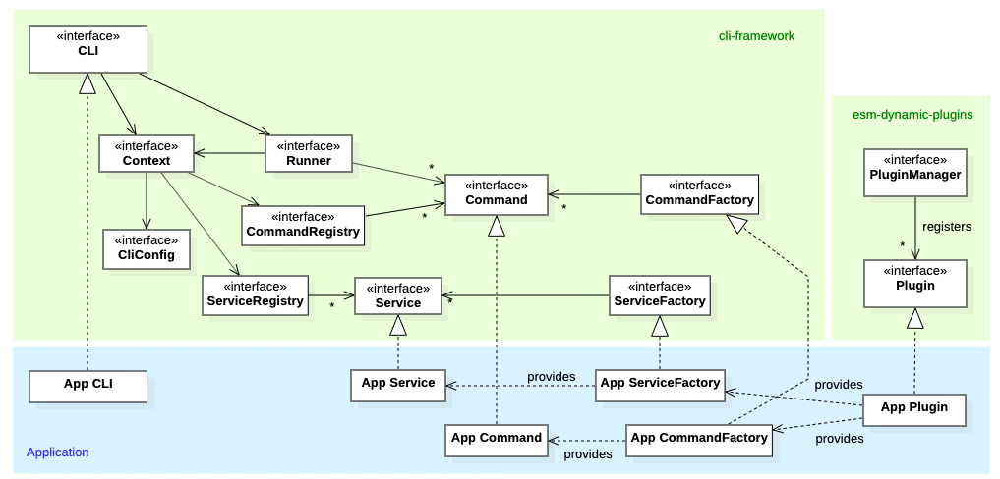
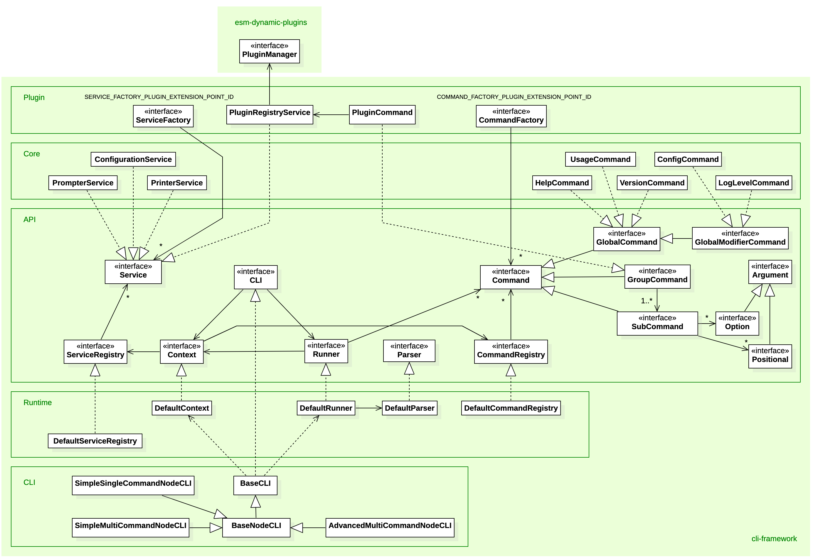

# cli-framework
[](https://github.com/flowscripter/cli-framework/blob/master/LICENSE)
[](https://david-dm.org/flowscripter/cli-framework)
[](https://travis-ci.com/flowscripter/cli-framework)
[](https://sonarcloud.io/dashboard?id=flowscripter_cli-framework)
[](https://www.npmjs.com/package/@flowscripter/cli-framework)

> CLI framework using ES Modules.

## Overview

This project provides a Javascript framework for developing Command Line Interface (CLI) applications.

#### Key Features

* ES2015 module based
* Written in Typescript
* Minimal dependencies
* Support for building:
    * Single command CLIs with global arguments e.g. `executable --<global_modifier_command_name> [argument]`
    * Multiple command CLIs with sub-command based arguments e.g. `executable <sub_command_name> [sub_command_arguments]`
    * Multiple command CLIs with grouped sub-command based arguments e.g. `executable <group_command_name> <member_sub_command_name> [member_sub_command_arguments]`
    * A mix of the above!
* Support for both optional and positional arguments e.g. `executable <sub_command_name> --<option_name>=<option_value> <positional_value>`
* Support for multiple value options e.g. `executable <sub_command_name> --<option_name>=<option_value_1> --<option_name>=<option_value_2>`
* Support for multiple value positionals ("varargs") e.g. `executable <sub_command_name> <positional_value_1> <positional_value_2>`
* Dynamic plugin based import of commands using [@flowscripter/esm-dynamic-plugins](https://github.com/flowscripter/esm-dynamic-plugins)
* Core (but optional) commands for help, logging level, version management and plugin management.
* Core (but optional) services for colour output to stdout and stderr, user prompting and configuration management.
* Support for persisted configuration

#### Key Concepts

The key concepts are:

* A host application implements the *CLI* interface (a default NodeJS specific CLI implementation is provided).
* The *CLI* is responsible for:
    * maintaining a *CommandRegistry* and ensuring the *Commands* it provides are available to a *Runner*.
    * providing invocation arguments to the *Runner* which parses them and determines which *Command* to run.
    * maintaining a *ServiceRegistry* and ensuring the *Services* it provides are available in a *Context*.
    * running the specified *Command* providing it with the parsed arguments and a *Context*.
* Dynamic plugins (enabled by [@flowscripter/esm-dynamic-plugins](https://github.com/flowscripter/esm-dynamic-plugins)
which makes use of ES2015 Dynamic Module Imports) are used to allow:
    * dynamic load and import of one or more
    *CommandFactory* implementations providing one or more *Command* implementations.
    * dynamic load and import of one or more
    *ServiceFactory* implementations providing one or more *Service* implementations.

The following high level class diagram illustrates these relationships:



## Commands

All functionality for a CLI is implemented within one or more *Commands*. A *Command* declares:

* a name which is to be used in command line arguments to invoke it.
* a function to run when the command is invoked.

The sub-types of command are: *GlobalCommand*, *GlobalModifierCommand*, *SubCommand* and *GroupCommand*

#### Global Command

A *GlobalCommand* provides the ability to invoke functionality via a global argument and one optional value:

    executable --<global_command_name>=[global_command_value]

Concrete examples:

    myNetworkApp --help=connect
    myNetworkApp --connect

A *GlobalCommand* also supports a short character alias which should always be an alphabetic ASCII character:

    executable -<global_command_short_alias>=[global_command_value]

Concrete examples:

    myNetworkApp -h=connect
    myNetworkApp -c

###### Global Command Values

A *GlobalCommand* also supports the provision of a value consisting of:

* a type of either: `number`, `boolean` or `string` (the default).
* an optional set of valid value choices.
* an optional default value.
* whether the value is mandatory.

There are three ways in which global command values can be specified:

    executable --<global_command_name>=<value>
    executable --<global_command_name> <value>
    executable -<global_command_short_alias> <value>

Concrete examples:

    myNetworkApp --help=connect
    myNetworkApp --help connect
    myNetworkApp -h=connect

For boolean options, specifying the value as `true` is not required. All of the following set the value to `true`:

    executable --<global_command_name>=true
    executable --<global_command_name> true
    executable --<global_command_name>
    executable -<global_command_short_alias>=true
    executable -<global_command_short_alias> true
    executable -<global_command_short_alias>

#### Global Modifier Commands

A *GlobalModifierCommand* is invoked in a similar manner to a *GlobalCommand*.

Any number of *GlobalModifierCommands* can be specified as long as they are accompanied by a *GlobalCommand*,
*GroupCommand* or *SubCommand*:

    executable --<global_modifier_command_1_name> [global_modifier_command_1_arguments] \
               --<global_modifier_command_2_name> [global_modifier_command_2_arguments] \
               <sub_command_name> [sub_command_arguments]

A concrete example:

    myNetworkApp --loglevel debug --config=config.json serve

where:

* `loglevel` is a global modifier command with a global command value of `debug`
* `config` is a global modifier command with a global command value of `config.json`
* `serve` is a sub-command.

Each *GlobalModifierCommand* will be executed before the single specified *GlobalCommand*, *SubCommand*
or *GroupCommand* is executed. This behaviour allows *GlobalModifierCommands* to modify
the context in which later commands run.

A *GlobalModifierCommand* defines a "run priority" which is used to determine the order of execution when multiple
*GlobalModifierCommands* are specified.

#### Sub-Command
A *SubCommand* provides the ability to invoke functionality via specifying the command name followed by any number of
option and positional arguments.

A sub-command is invoked as follows:

    executable <sub_command_name> [sub_command_arguments]

A concrete example:

    myNetworkApp serve --host=localhost

###### Sub-Command Arguments

Arguments for a *SubCommand* can take two forms: *Option* or *Positional*.

Common to both are the following features:

* a name which must consist of alphanumeric non-whitespace ASCII characters or `_` and `-` characters.
It cannot start with `-`.
* a type of either: `number`, `boolean` or `string` (the default).
* an optional set of valid value choices.

**Options**

An *option* argument also provides for:

* a short character alias for the option which should always be an alphabetic ASCII character.
* whether the option is mandatory.
* an optional default value.
* whether the option can be specified more than once e.g.:


    executable <sub_command_name> --<option_name_1>=foo --<option_name_1>=bar

There are four ways in which options can be specified:

    executable <sub_command_name> --<option_name>=<option_value>
    executable <sub_command_name> --<option_name> <option_value>
    executable <sub_command_name> -<option_short_alias>=<option_value>
    executable <sub_command_name> -<option_short_alias> <option_value>

For boolean options, specifying the value as `true` is not required. All of the following set the value to `true`:

    executable <sub_command_name> --<boolean_option_name>=true
    executable <sub_command_name> --<boolean_option_name> true
    executable <sub_command_name> --<boolean_option_name>
    executable <sub_command_name> -<boolean_option_short_alias>=true
    executable <sub_command_name> -<boolean_option_short_alias> true
    executable <sub_command_name> -<boolean_option_short_alias>

**Positionals**

A *positional* argument is specified by a value which appears at the correct position in the list of *SubCommand*
arguments:

     executable <sub_command_name> <positional_1_value> <positional_2_value>

A concrete example:

    myHelloWorldApp say hello

where:

* `say` is a sub-command.
* `hello` is the value for the first positional argument.

A *positional* argument also provides for "varargs" support (both optional and multiple) which allows for
zero, one or more entries:

**NOTE**: Only one "varargs" positional can be defined and it must be the last positional expected for the command.

If "varargs" optional is set for `positional_1`, these are valid:

     executable <sub_command_name>
     executable <sub_command_name> <positional_1_value_1>

If "varargs" multiple is set for `positional_1`, these are valid:

     executable <sub_command_name> <positional_1_value_1>
     executable <sub_command_name> <positional_1_value_1> <positional_1_value_2>

If "varargs" optional AND multiple is set for `positional_1`, these are valid:

     executable <sub_command_name>
     executable <sub_command_name> <positional_1_value_1>
     executable <sub_command_name> <positional_1_value_1> <positional_1_value_2> <positional_1_value_3>

#### Group Command

A *GroupCommand* allows multiple member *SubCommands* to be grouped under a single named group. The name of the
*GroupCommand* is specified before the desired member *SubCommand* in one of two ways:

    executable <group_command_name> <member_sub_command_name> [member_sub_command_arguments]
    executable <group_command_name>:<member_sub_command_name> [member_sub_command_arguments]

Concrete examples:

    myNetworkApp utils ping --host=localhost
    myNetworkApp utils:ping --host=localhost

A *GroupCommand* also provides for a command to be invoked BEFORE the specified sub-command. However,
a *GroupCommand* does not support any arguments itself (apart from the member *SubCommand* name and its arguments).

## Runner

Core CLI behaviour is provided by a *Runner* implementation which is responsible for parsing invocation arguments,
determining which *Command* to run and then running it.

#### Default Command

The provided default implementation of *Runner* (*DefaultRunner*) supports specification of a default command which
should be run if no command names are parsed on the command line. In this scenario, any arguments provided will be
parsed as possible arguments for the default command as well as potential Global Modifier Commands.

#### Logic Overview

The following activity diagram illustrates the *DefaultRunner* logic:


## Parser

The *Runner* defers to a *Parser* implementation which performs the actual argument parsing.

The following parsing rules apply for the provided *DefaultParser* implementation:

**Arguments Must Follow Command**

All arguments for a command are expected to FOLLOW the command i.e. this is **NOT** valid:

    executable <sub_command_argument> <sub_command_name>

**Arbitrary Option Order**

The order of options for a particular command is not important i.e. these are equivalent:

    executable <sub_command_name> --<option_1_name> <option_1_value> --<option_2_name> <option_2_value>
    executable <sub_command_name> --<option_2_name> <option_2_value> --<option_1_name> <option_1_value>

**Arbitrary Command Order**

The order of commands is not important i.e. these are equivalent:

    executable <sub_command_name> [sub_command_arguments] --<modifier_command_1> [modifier_command_1_arguments] \
               --<modifier_command_2> [modifier_command_2_arguments]
    executable --<modifier_command_1> [modifier_command_1_arguments] <sub_command_name> [sub_command_arguments] \
               --<modifier_command_2> [modifier_command_2_arguments]

**No Command Interleaving**

Arguments for commands cannot be interleaved with other commands i.e. this is **NOT** valid:

    executable --<modifier_command_name> <sub_command_name> [sub_command_arguments] [modifier_command_arguments]

**Single Command**

Apart from global modifier commands, there is expected to be only one command specified i.e. these are **NOT** valid:

    executable <sub_command_1_name> [sub_command_1_arguments] <sub_command_2_name> [sub_command_2_arguments]
    executable --<global_command_name> <sub_command_name> [sub_command_arguments]

**Group Command**

A group command name must always be following immediately by a container sub-command name i.e. these are **NOT** valid:

    executable <member_sub_command_name> <group_command_name>
    executable <group_command_name> <global_command_name> <member_sub_command_name>

**Leading Arguments and Unused Trailing Arguments**

Any leading arguments which appear BEFORE an identified command name are retained. Any trailing arguments which appear
after an identified name and are not consumed when parsing the command arguments are also retained.

Once a command has been identified and parsed any retained arguments are considered unused and a warning is output.

If a command is NOT identified any retained arguments are considered potential arguments for a default command if it
has been configured. This behaviour means the following are all equivalent:

    executable <default_command_argument> --<modifier_command_name> <modifier_command_argument>
    executable --<modifier_command_name> <modifier_command_argument> <default_command_argument>
    executable --<modifier_command_1_name> <modifier_command_1_argument> <default_command_argument> \
               --<modifier_command_2_name> <modifier_command_2_argument>

## Core Support
The following core services and commands are provided in the project and used within the provided `BaseCLI` and `NodeCLI`.

#### Core Services
Core service interfaces are provided together with a default implementation for printing output to the user, requesting input
from the user and reading/writing configuration.

###### Printer Service
Two printer services are registered in the context under the IDs:

* `STDOUT_PRINTER_SERVICE`
* `STDERR_PRINTER_SERVICE`

Both of these provide the ability for commands to:

* output text at debug, info, warn and error levels together with a threshold filter
* add optional success, failure, alert or information icons
* enable or disable colour output and also print bold text
* show and hide a spinner

###### Prompter Service
The prompter service is registered in the context under the ID `PROMPTER_SERVICE`.

This provides the ability for commands to prompt for user input of a number, boolean, string, password or to select
from a list of choices.

###### Configuration Service
The configuration service is registered in the context under the ID `CONFIGURATION_SERVICE`.

This service provides the ability to:

* read and write configuration data from a YAML file in the default location of `$HOME/.<context.cliConfig.name>.yaml`
* get and set config for commands and services

Note that in the default location, the `name` used will be stripped of all non-alphanumeric characters (except `_` and `-`).

#### Core Commands
Core commands are provided to manage the output of the CLI, the location of configuration and to provide help to the user.

The dependencies these commands have on core services are outlined below.

###### Log Level Command
The `LogLevel` command overrides the default level threshold (`INFO`) of the printer services.

**NOTE**: This requires two `Printer` services in the context registered with the IDs `STDOUT_PRINTER_SERVICE` and
`STDERR_PRINTER_SERVICE`.

###### No Color and Color Commands
The `NoColor` and `Color` commands override the auto-detected colour state of the printer services.

**NOTE**: These require two `Printer` services in the context registered with the IDs `STDOUT_PRINTER_SERVICE` and
`STDERR_PRINTER_SERVICE`.

###### Config Command
The `Config` command overrides the default location (`$HOME/.<context.cliConfig.name>.yaml`) of the YAML configuration file.

**NOTE**: This requires a `Printer` service in the context registered with the ID `STDERR_PRINTER_SERVICE` and
a `Configuration` service registered with the ID `CONFIGURATION_SERVICE`.

###### Version Command
The `VersionCommand` simply outputs the CLI application version to stdout.

**NOTE**: This requires a `Printer` service in the context registered with the ID `STDOUT_PRINTER_SERVICE`.

###### Usage Command
The `UsageCommand` provides a very simple help output. It is configured as the default command for the
`BaseCLI` and `NodeCLI`.

**NOTE**: This requires a `Printer` service in the context registered with the ID `STDOUT_PRINTER_SERVICE` and it
also requires provision of a `HelpCommand`.

###### Help Command
The `HelpCommand` outputs either generic help for the CLI (listing all commands available) or specific help for
a command if it was specified as an argument.

**NOTE**: This requires a `Printer` service in the context registered with the ID `STDOUT_PRINTER_SERVICE`.

## Plugin Support

Dynamic discovery and registration of [@flowscripter/esm-dynamic-plugins](https://github.com/flowscripter/esm-dynamic-plugins) plugins
providing `Command` and `Service` implementations is supported.

#### Plugin Registry Service
The `PluginRegistryService` is responsible for instantiating a [@flowscripter/esm-dynamic-plugins](https://github.com/flowscripter/esm-dynamic-plugins)
`PluginManager` which can then be used to discover available command and service plugins and add these to the `ServiceRegistry` and `CommandRegistry`.

#### Plugin Command
The `PluginCommand` is a group command providing `AddCommand` and `RemoveCommand`. These implement a VERY BASIC
NPM functionality assuming that plugins are bundled packages i.e. there is no need to install their declared
dependencies. Because of this the following is the case:

* No support is provided for multiple versions of the same package.
* All packages are installed at the top level or at scoped level i.e. there are no installations below other
 packages to accommodate multiple versions.

As well as this the following limitations currently exist:

* The installed set of packages is assumed to always be in a valid state and to have not been modified manually
or by another process!
* The only `dist-tag` supported is `latest`.
* Package checksums are not verified!
* Git URLS are not supported.

**NOTE:** If this basic implementation doesn't suffice you can always use `npm` or `yarn` to install plugin packages.

## Node CLI
The `BaseCLI` expects to be provided a `CLIConfig` object containing the CLI application's name, version and
description together with streams to use for `stdout` and `stderr`.

The `BaseNodeCLI` implementation is a simple extension to the `BaseCLI` which provides the name, version and description from
the current project's `package.json` and uses the NodeJS provided `process.stdout` and `process.stderr` streams.

`SimpleSingleCommandNodeCLI`, `SimpleMultiCommandNodeCLI` and `AdvancedMultiCommandNodeCLI` provide ready to go
CLI classes with increasing levels of complexity. These can be used by simply implementing a `Command` interface
and passing this into the constructor.

## Example Projects

[ts-example-cli](https://github.com/flowscripter/ts-example-cli) is a demo CLI Typescript application based on
this framework.

[js-example-cli](https://github.com/flowscripter/js-example-cli) is a demo CLI Javascript application based on
this framework.

[ts-example-cli-plugin](https://github.com/flowscripter/ts-example-cli-plugin) is a demo Typescript command plugin based on
this framework.

[js-example-cli-plugin](https://github.com/flowscripter/js-example-cli-plugin) is a demo Javascript command plugin based on
this framework.

The [plantuml-proxy-cli](https://github.com/vectronic/plantuml-proxy-cli) provides a simple real world single command CLI use case.

The Flowscripter [cli](https://github.com/flowscripter/cli) provides a complex real world multiple command CLI use case. This implements
custom commands for a REPL and a script executor.

## Code Documentation

[Typescript documentation](https://flowscripter.github.io/cli-framework)

## Development

**NOTE**: End-to-end testing is only performed on MacOS and Linux (not Windows).

Firstly:

```
npm install
```

then:

Build: `npm run build` (excuse the rollup warning, npm pacote library brings in a lot of cruft)

Watch: `npm run watch`

Test: `npm test`

Lint: `npm run lint`

Docs: `npm run docs`

[Debug](https://github.com/visionmedia/debug) logging is implemented for the internals of the framework and can be enabled
with the `DEBUG` environment variable e.g.:

    DEBUG=* myHelloWorldApp say hello

The following diagram provides an overview of the main classes:



## Further Details

Further details on project configuration files and Javascript version support can be found in
the [template for this project](https://github.com/flowscripter/ts-template/blob/master/README.md#overview).

## Alternatives

There are two popular alternatives available. Both are well documented and feature rich and you are encouraged to explore them:

* [oclif](https://oclif.io)
* [Gluegun](https://infinitered.github.io/gluegun)

The essence of a CLI framework implementation consists of:

1. **A plugin mechanism**: Neither of the above alternatives provided a dynamic, abstracted plugin import mechanism
based on ES2015 modules:
    * `oclif` relies on available plugins being declared in `package.json`.
    * `Gluegun` supports dynamic loading of plugins based on a required folder structure.
1. **Parsing input/printing output**: to achieve this functionality, both of the above alternatives
rely heavily on other CLI support packages under the hood e.g. [yargs-parser](https://github.com/yargs/yargs-parser) or
[colors.js](https://github.com/Marak/colors.js) etc.

    * This is sensible, but both seem to suffer from feature creep as they move towards being a 'product' in their own
    right and both come with a growing list of dependencies. This project aims for a lightweight, abstracted service model
    so that almost all features are optional and customisable. It also aims to keep the core runtime clear of
    ANY behavioural logic e.g. reading from configs, logging, help etc. Where dependencies necessarily creep in, the
    resulting distributable size is minimised thanks to tree-shaking.

    * This project had some pretty specific requirements for argument parsing to accommodate the ideas of global
    modifier commands. [yargs-parser](https://github.com/yargs/yargs-parser) was a bit over-powered and
    yet still didn't quite fit the bill, despite some serious trials. A lot of time was also spent with
    [command-line-args](https://github.com/75lb/command-line-args) but the need to hack in support for positional
    args caused endless pain.

Additional reasons for the existence of this project include:

* Despite the wonders of transpilers and bundlers, both alternatives mentioned above proved quite hard to get
 working in a native ES2015 application.
* There was no native ES2015 CLI framework - until now...

## License

MIT © Flowscripter
